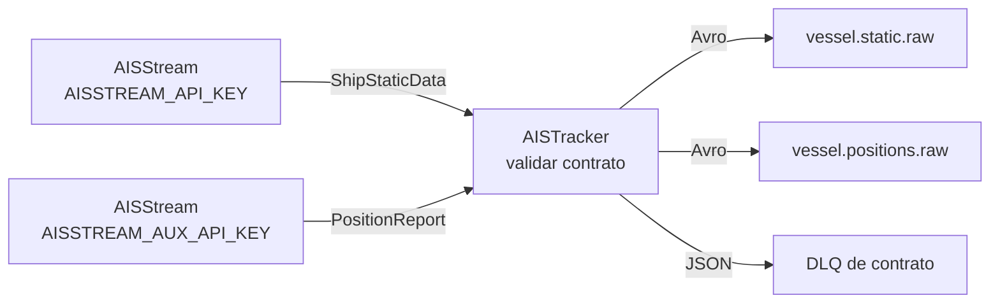

# Ingestion — adquisición de datos y publicación en Kafka

Ingestion tiene **una responsabilidad única**: adquirir datos de fuentes externas,
validarlos con Pydantic contra los contratos de `contracts/`, serializarlos con
**Avro (Schema Registry)** y publicarlos en Kafka. **Sin lógica de negocio**: nada de
selección de buques, plausibilidad, enriquecimiento ni maestro de flota — todo eso vive
en Flink (ver `streaming/README.md`).

Se publica **todo** el AIS que entra por la suscripción, en crudo. El único criterio de
selección es la bounding box, y lo aplica AISStream en el servidor. Sobre ese crudo,
Flink deriva lo que necesite: flota con destino a los puertos objetivo, atraques, cupo,
congestión. Un filtro aquí sería irreversible; en Flink es una consulta.

## Arquitectura

El servicio AIS es **un solo proceso perpetuo** con dos conexiones WebSocket, una por
API key. Ambas validan contra el contrato y publican, sin estado compartido:



| Conexión | API key | Tipo de mensaje | Topic destino |
|----------|---------|-----------------|---------------|
| estática | `AISSTREAM_API_KEY` | `ShipStaticData` | `KAFKA_TOPIC_STATIC` |
| posición | `AISSTREAM_AUX_API_KEY` | `PositionReport` | `KAFKA_TOPIC_POSITIONS` |

Las dos conexiones corren como tareas asyncio del mismo event loop y cada una reconecta
por su cuenta con backoff exponencial. No comparten estado, así que son independientes:
si `AISSTREAM_AUX_API_KEY` no está definida, ambos tipos de mensaje llegan por una sola
conexión y el comportamiento es idéntico.

### Área de cobertura

Ambas conexiones se suscriben a `constants.AIS_COVERAGE_BBOX`, por defecto
`MEDITERRANEAN_BBOX`. Es el **único** filtro del productor:

- Un buque que entra en el área empieza a publicarse sin ninguna acción.
- Un buque que sale deja de llegar, sin estado que mantener ni limpiar.
- El caudal de mensajes crece con el área, pero no proporcionalmente: depende de la
  densidad de tráfico. Ampliar de la cuenca occidental al Mediterráneo completo
  multiplicó el área por 6,8 y el caudal solo por 2,6, porque buena parte de lo añadido
  es Atlántico abierto.

| | Cobertura |
|---|---|
| Latitud | 26,90°N a 45,89°N — de bajo Canarias al Adriático norte |
| Longitud | -25,84°E a 25,40°E — de las Azores al Egeo |
| Incluye | Los tres puertos objetivo, el Estrecho de Gibraltar, la aproximación atlántica, y el Mediterráneo hasta Creta |
| **Excluye** | Mediterráneo oriental: Chipre, Levante, Alejandría, Suez y el Bósforo. Los buques que vienen de ahí aparecen al cruzar los 25,4°E |

> **Al copiar coordenadas de un mapa**: AISStream ordena `[lat, lon]`, mientras que
> bboxfinder y herramientas similares dan `minLon,minLat,maxLon,maxLat`. Hay que
> invertir cada par.

`AIS_COVERAGE_BBOX` es una **lista** de bounding boxes y AISStream acepta varias por
suscripción: para cubrir otras regiones se añaden cajas a la lista.

### Límites de AISStream que condicionan el servicio

- **Una conexión por API key.** El número de conexiones lo fija el número de keys.
- **La entrega es un muestreo**, no todos los reportes: ~1 posición por buque cada
  90-120 s, ~9 msg/s en total sobre `MEDITERRANEAN_BBOX` (medido: 680 mensajes en 75 s).
  Suficiente para optimizar RPM/ETA en travesías de horas; no sirve para maniobra fina
  ni anticolisión.

### Modo sintético (temporal)

AISStream dejó de servir datos el 5-ago-2026 (conexión sana, sin errores, cero
mensajes; ver [aisstream/issues#257](https://github.com/aisstream/issues/issues/257),
no es un problema de esta cuenta). Mientras se resuelve, `AIS_SYNTHETIC=true` sustituye
la conexión real por `ais/synthetic.py`: un generador que simula buques moviéndose por
rutas marítimas reales (`searoute`) entre puertos reales, con una parte respaldada por
IMO real de `thetis_mrv` (para que el JOIN de Flink los resuelva de verdad) y las
mismas rarezas del AIS real medidas en `docs/ais_catalogos.md`.

Presenta la misma interfaz `.stream()` que `AISStreamClient`, así que `tracker.py`,
`client.py`, `models.py` y `publisher.py` no cambian: el resto del pipeline no distingue
el origen de los mensajes. El único marcador es el **MMSI 990xxxxxx** — ningún buque
real usa ese prefijo — para poder identificar el tráfico sintético sin ambigüedad si
algún día coincide en el tiempo con datos reales.

Desactivar con `AIS_SYNTHETIC=false` en cuanto AISStream se recupere. Es un bloque
autocontenido: quitar la variable y borrar `ais/synthetic.py` +
`ais/synthetic_fixtures.json` deja el servicio exactamente como estaba.

## Estructura

```
ingestion/src/
  ais/                  # Servicio AIS -> Kafka (production-ready)
    client.py           #   WebSocket AISStream con reconexión + backoff
    models.py           #   Contratos Pydantic (AISPosition, AISStatic) -> dict Avro
    publisher.py        #   Productor SSL + Avro/Schema Registry (MMSI key, ULID header)
    tracker.py          #   Enruta los 2 tipos de mensaje -> 2 topics; rate-limit; DLQ
    synthetic.py        #   Generador sintético temporal (AIS_SYNTHETIC=true)
    synthetic_fixtures.json  # Buques (IMO real de THETIS) y puertos para synthetic.py
  reference/            # Cargas puntuales de referencia -> PostgreSQL (Supabase)
    db.py               #   Conexión psycopg + DDL (ports, thetis_mrv) + UPSERTs
    locode.py           #   UN/LOCODE -> tabla ports
    thetis.py           #   THETIS-MRV -> tabla thetis_mrv
  producer.py           # Facade: monta las conexiones y el tracker
  config.py, constants.py
```

## Dos responsabilidades, dos ejecuciones

### 1. Servicio AIS (streaming -> Kafka)

```bash
uv run python main.py
```

Corre indefinidamente y sin estado: no hay descubrimiento, registro de flota ni fases.
Cada mensaje que llega se valida y se publica.

| Endpoint AIS | Topic Kafka | Contrato |
|--------------|-------------|----------|
| PositionReport | `KAFKA_TOPIC_POSITIONS` | `contracts/ais_position_v1.avsc` |
| ShipStaticData | `KAFKA_TOPIC_STATIC` | `contracts/ais_static_v1.avsc` |
| Fallo de contrato | `KAFKA_TOPIC_DLQ` | JSON plano `{reason, message_type, raw}` |

MMSI como **partition key**; ULID de linaje en **headers** (topics principales y DLQ).
Ambos contratos incluyen el metadato interno `_ingested_at` (prefijo `_` = no forma
parte del payload AIS original): instante UTC ISO-8601 en que `AISPosition`/`AISStatic`
validaron el mensaje (ver `models.py`), no el instante del propio reporte AIS.

Los mensajes de tipos AIS no enrutados (`AidsToNavigationReport`, etc.) se ignoran sin
publicar y sin contar.

#### Recorrido de un mensaje

Ambos tipos siguen exactamente el mismo camino, sin ramas por buque:

1. Llega por la conexión suscrita a la bounding box.
2. Se enruta por `MessageType` a su contrato Pydantic. Tipo no enrutado → se ignora.
3. Validación del contrato. Si falla → DLQ de contrato, fin.
4. Rate limit de publicación (si `PUBLISH_RATE_LIMIT` > 0).
5. Serialización Avro contra Schema Registry → topic. Si la serialización falla → DLQ.

#### Campos crudos que consume Flink

El productor no interpreta estos campos, solo los transporta validados. Son los que
permiten a Flink reconstruir cualquier criterio de selección:

| Campo | Contrato | Para qué lo usa Flink |
|-------|----------|----------------------|
| `destination` | estática | flota con destino a los puertos objetivo |
| `ship_type` | estática | clasificación de buque (carga AIS 70-79, tanque, pasaje…) |
| `length_m`, `beam_m`, `draught_m` | estática | metros de muelle, calado disponible |
| `eta` | estática | ETA declarada por el capitán |
| `imo` | estática | LEFT JOIN con `thetis_mrv` |
| `nav_status` | posición | atracado (5), fondeado (1), en navegación… |
| `lat`, `lon`, `speed`, `cog` | posición | geometría, cupo de atraques, congestión |

`ship_type` y `nav_status` son códigos numéricos del estándar ITU-R M.1371 que el
productor transporta sin traducir. Los catálogos completos, con la distribución medida
sobre el flujo real y los valores centinela de "sin dato", están en
[`docs/ais_catalogos.md`](../docs/ais_catalogos.md).

#### DLQ de contrato

`ContractError` se lanza cuando Pydantic rechaza el mensaje crudo. Dos causas:

- **Campo inválido**: `lat` fuera de `[-90, 90]`, `mmsi ≤ 0`, `speed < 0`, etc.
- **Campo ausente o tipo incorrecto**: el mensaje AIS no trae un campo obligatorio o no es convertible.

El payload en la DLQ incluye la razón textual y el mensaje AIS original completo para
facilitar la depuración del contrato. La validación **semántica** (buque en tierra,
salto imposible, spoofing) no ocurre aquí — es responsabilidad de Flink.


#### Trazas en operación

```
[INICIO] SERVICIO DE INGESTA AIS -> KAFKA
[INICIO][Tracker] 2 conexión(es) AIS -> topics dev-vessel-positions-raw / dev-vessel-static-raw
[ADVERTENCIA][AIS] Desconectado (...); reintento en 1s
[ESTADO][Tracker] {'position': 9840, 'static': 2871, 'rejected': 4}
```

El informe `[ESTADO]` sale cada `STATS_INTERVAL_SECONDS`. `rejected` cuenta los fallos
de contrato (los que van a la DLQ); si crece rápido, revisa la DLQ.

El proceso corre hasta que se lo cancele y cada conexión reconecta sola, así que
conviene supervisarlo (`Restart=always` en systemd o política equivalente). Al no haber
estado en memoria, un reinicio no pierde nada: se reanuda la publicación con el
siguiente mensaje.

### 2. Carga de referencia (point-in-time -> PostgreSQL)

```bash
uv run python -m ingestion.src.reference.locode   # UN/LOCODE -> ports
uv run python -m ingestion.src.reference.thetis   # THETIS-MRV -> thetis_mrv
```

Flink consume estas tablas (LEFT JOIN por IMO / resolución de destino).

> **Conexión directa a Supabase = solo IPv6.** `db.<ref>.supabase.co` no tiene registro
> A, solo AAAA. Una VM sin IPv6 configurado (p.ej. una Azure VM con red por defecto,
> solo IPv4) nunca podrá conectar aquí, aunque el proyecto esté activo: el error es
> `Network is unreachable`, no un fallo de credenciales. Por eso estas cargas están
> pensadas para ejecutarse desde un portátil, no desde la VM de ingesta — y por eso
> `synthetic.py` lee `thetis_mrv.xlsx`/`un_locode.csv` en local para construir su
> fixture (una vez, aquí) en lugar de consultar Postgres en cada arranque.

## Fuentes de datos (reales)

| Fuente | Procedencia |
|--------|-------------|
| AISStream | WebSocket en vivo (requiere `AISSTREAM_API_KEY` con cuota). |
| UN/LOCODE | `improved-un-locodes` (UNECE + coords OSM/Wikidata); auto-descarga a `data/reference/`. |
| THETIS-MRV | Fichero anual público de EMSA (**descarga manual**, reCAPTCHA) en `data/reference/thetis_mrv.xlsx`. El fichero NO trae DWT/GT directos: el DWT se **deriva** del trabajo de transporte (solo buques que reportan en base dwt). |

## Configuración (entorno)

| Variable | Oblig. | Por defecto | Función |
|----------|--------|-------------|---------|
| `AISSTREAM_API_KEY` | sí | — | Key de la conexión de estáticas |
| `AISSTREAM_AUX_API_KEY` | no | — | Key de la conexión de posiciones; sin ella, ambos tipos comparten conexión |
| `KAFKA_BROKER_URL` | sí | — | `<host>:<puerto>` del broker |
| `KAFKA_SSL_CA_LOCATION` | no | `./.certs/ca.pem` | Certificado CA |
| `KAFKA_SSL_CERT_LOCATION` | no | `./.certs/service.cert` | Certificado de cliente |
| `KAFKA_SSL_KEY_LOCATION` | no | `./.certs/service.key` | Clave de cliente |
| `KAFKA_TOPIC_POSITIONS` | sí | — | Topic de `PositionReport` |
| `KAFKA_TOPIC_STATIC` | sí | — | Topic de `ShipStaticData` |
| `KAFKA_TOPIC_DLQ` | no | — | Topic de la DLQ; si falta, se corre sin DLQ |
| `KAFKA_SCHEMA_REGISTRY_URL` | sí | — | Karapace de Aiven (puerto aparte del broker) |
| `KAFKA_SCHEMA_REGISTRY_AUTH` | no | — | Auth básica `avnadmin:<password>` |
| `PGHOST`, `PGPORT`, `PGDATABASE`, `PGUSER`, `PGPASSWORD`, `PGSSLMODE` | sí (solo `reference/`) | `5432`, `postgres`, `require` | PostgreSQL de la capa de referencia |
| `PUBLISH_RATE_LIMIT` | no | `0` | Mensajes/seg publicados a Kafka; 0 = sin límite |
| `PUBLISH_RATE_BURST` | no | `1` | Ráfaga tolerada tras un período ocioso |
| `STATS_INTERVAL_SECONDS` | no | `60` | Cadencia del informe `[ESTADO]`; 0 = sin traza |
| `AIS_SYNTHETIC` | no | `false` | Sustituye AISStream por el generador sintético temporal (ver arriba) |
| `SYNTHETIC_POSITION_INTERVAL_SECONDS` | no | `100` | Intervalo medio de `PositionReport` por buque simulado |
| `SYNTHETIC_STATIC_INTERVAL_SECONDS` | no | `360` | Intervalo medio de `ShipStaticData` por buque simulado |

El área de cobertura no es una variable de entorno: vive en `constants.py`
(`AIS_COVERAGE_BBOX`).

Ver `.env.example` en la raíz del proyecto para la plantilla completa.

> El código es production-ready pero no se ejecuta contra Supabase/Kafka reales en
> local; configura el entorno y despliega (imágenes ARM64 en OCI).
